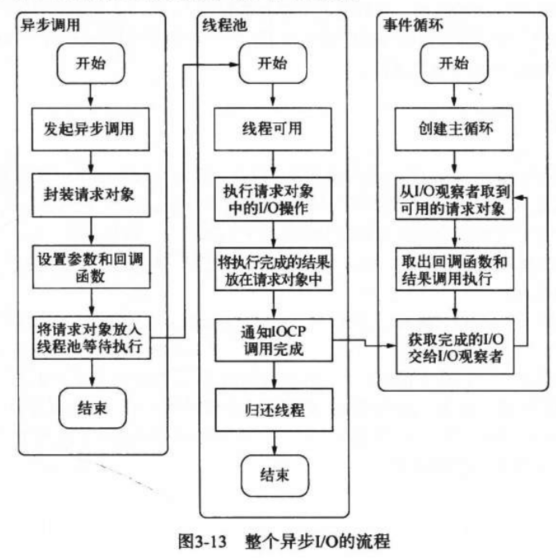

从运行结构来看Node

## 为什么要异步I/O

- Node面向网络设计，在跨网络的设计中，并发是标配
- 用户体验：增加响应速度，使资源加载变快，这样浏览器端JS就不会阻塞UI太久
- 资源分配：利用异步I/O远离阻塞，提高硬件资源利用率。新增WebWorker弥补不能利用多核CPU的缺点

## 如何实现异步I/O

### 系统对异步I/O的支持

- 轮询
	- `read`
		- 最原始，性能最低
		- 在得到最终数据前重复访问
	- `select`
		- 在`read`基础上改进，根据对文件描述符上的事件状态(是否读取完毕)进行判断是否访问
		- **限制**：最多可以同时检查`1024`个文件描述符
	- `poll`
		- 在`select`基础上改进，使用链表存储状态，避免了长度限制
		- 其次性能改进但不多
	- `epoll`
		- `linux`下效率最高
		- 没有消息通知时进入休眠，有消息时执行回调
	- `kqueue`
		- 与`epoll`类似，但仅在`FreeBSD`下存在
- 理想：应用程序发起非阻塞调用，无需遍历和消息等轮询，直接处理下一个任务(现在是CPU会有个休眠阶段)
- 现实：使用线程池与阻塞I/O模拟异步I/O

### Node的异步I/O

- 事件循环
	- 不断访问事件队列查看是否有事件待处理的循环，如果有就取出事件和回调，并执行回调
	- 事件循环是一个典型的**生产者/消费者模型**
	- Windows下使用IOCP实现，Linux下使用多线程实现
- 观察者
	- 观察可能产生事件的生产者，事件发生后会传到观察者
	- 事件循环通过观察者判断是否有要处理的事件
- 请求对象
	- 从JS发起调用到内核执行完I/O操作的过渡过程中的中间产物
	- 保存了所有状态，例如执行结果和回调
- I/O线程池
	- 请求对象会被存入I/O线程池等待系统I/O调用，在执行完毕后会通知IOCP调用完成

## 非I/O的异步API

- 定时器
	- 时间不准确
	- `setTimeout(fn, ms)`
	- `setInterval(fn, ms)`
- `process.nextTick()`
	- 延迟执行，回调函数保存在数组中
	- 队列由Node管理
	- 行为上：每轮循环时会将数组中的全部回调都执行
	- 可以理解为`setTimeout(fn,0)`的高性能版本
	- `queueMicroTask()`
		- 队列由V8管理
		- `process.nextTick()`先于`queueMicroTask()`执行
- `setTmmediate()`
	- 延迟执行，回调函数保存在链表中，优先级小于`process.nextTick`(与事件循环的顺序有关)
	- 行为上：每轮循环只执行一个回调

### 执行顺序

- [stackoverflow](https://stackoverflow.com/questions/55467033/difference-between-process-nexttick-and-queuemicrotask)

1. 同步执行一遍代码，此时各队列都有了各自的任务(`nextTick`,`MicroTask`,`timers`,`immediate`)
2. 把`nexttick`执行完，如果有新`nexttick`加入，则继续执行，直到为空
3. 再把`microtask`执行完，如果有`nexttick`就转去执行`nexttick`，最后清空`nexttick`和`microtask`
4. 然后是`timers`也一样
5. 最后是`immediate`

## 事件驱动与高性能服务器

1. 网络请求（内核）：监听端口 `->` 接受网络请求 `->` 发送给I/O观察者形成事件 `->`
2. 事件循环（Libuv）：执行I/O观察者中事件的回调函数 `->` 如果有业务层的回调就执行回调函数，否则进入到下一个Tick `->`
3. 执行回调（JS）：绑定请求事件 `->` 如果事件循环要求执行回调就执行对应的回调函数
